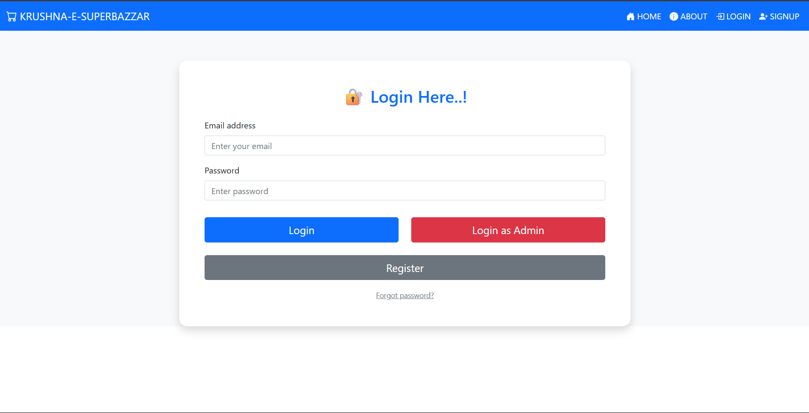
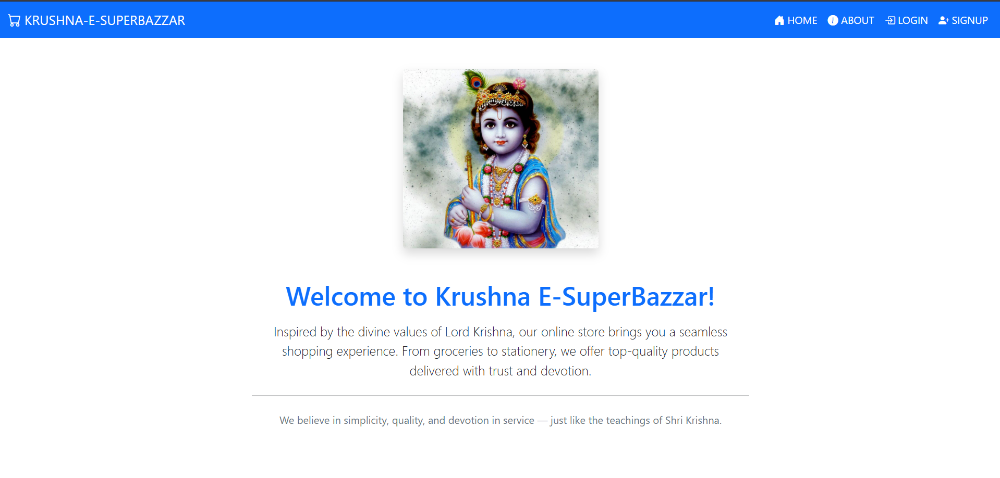
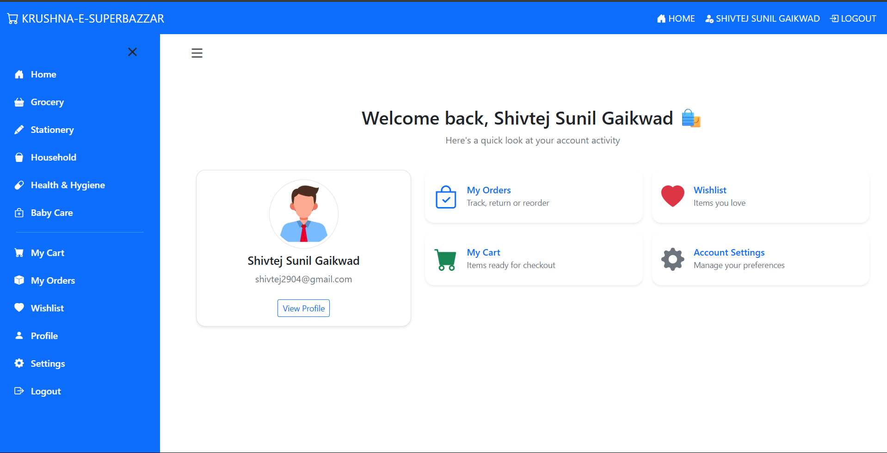
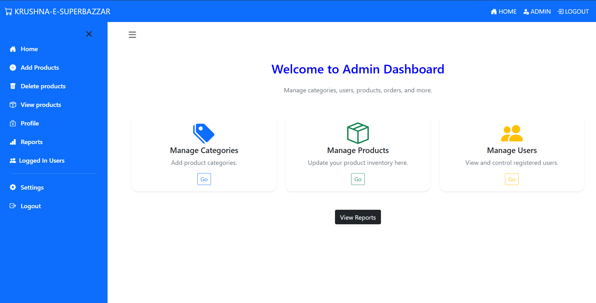
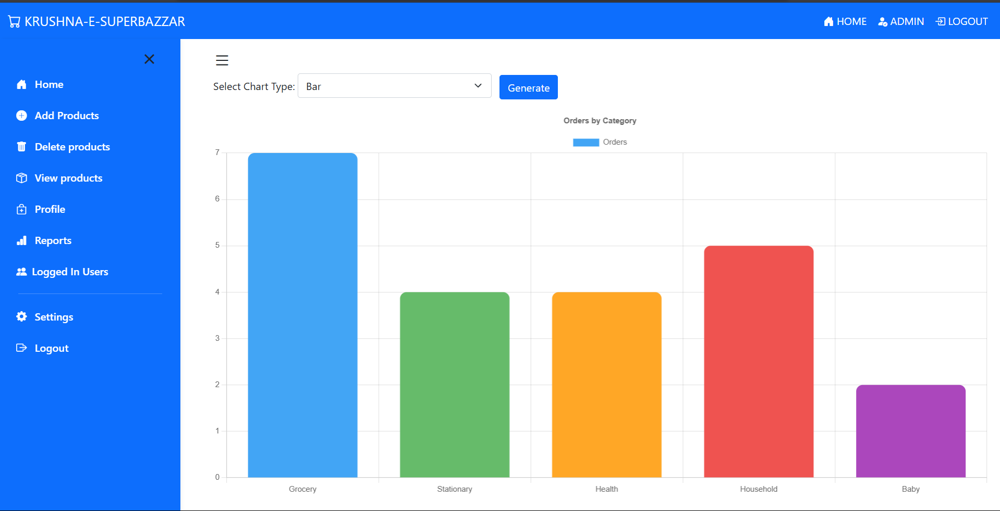

# 🛒 Ekrushnae Super Bazzar

**Ekrushnae Super Bazzar** is a web-based eCommerce platform designed for managing and selling grocery and stationery items. It features both admin and user interfaces, allowing for efficient management and browsing of products.

---

## 🌐 Key Features

- 🛒 Two categories: Grocery and Stationery
- 🔐 Secure login system for Admin and Users
- 👨‍💼 Admin Panel to:
  - Add/Edit/Delete products
  - Upload product images
  - View reports
- 👤 User Panel to:
  - Browse and search items
  - View product details
- 🔍 Search functionality
- 📑 About section
- 📊 Report generation (for Admin)

---

## 🖥️ Technologies Used

- **Frontend**: HTML5, CSS3, JavaScript, JSP
- **Backend**: Java (Servlets, JSP)
- **Database**: MySQL
- **Server**: Apache Tomcat

---

## 📷 Screenshots

> All screenshots are stored in the `webimages/` folder.

### 🔐 Login Page  


### 🏠 Home Page  


### ℹ️ About Page  


### 👤 User Panel  


### 🧑‍💼 Admin Panel  


### 📊 Report Page  


---

## ⚙️ How to Run the Project

1. **Clone the repository**
   ```bash
   git clone https://github.com/yourusername/ekrushnae-super-bazzar.git
2. **Database Setup**
   Import the provided .sql file into MySQL
   Update DB credentials in your DBConnection.java or context.xml if used

3. **Configure Server**
Deploy the project in Apache Tomcat (e.g., via Eclipse/IntelliJ or manually)

4. **Run the Application**
Access the app at http://localhost:8080/home

## Folder Structure
ekrushnae-super-bazzar/
│
├── webimages/           # All website images (used in frontend & README)
├── src/                 # Java Servlet and JSP code
├── WEB-INF/             # Web.xml and configurations
├── sql/                 # SQL scripts for DB setup
├── index.jsp            # Homepage
├── login.jsp            # Login page
├── admin/               # Admin panel pages
├── user/                # User panel pages
└── README.md

👤 Author
Shivtej Gaikwad
📧 Email: [your-email@example.com]
🌐 LinkedIn: [your-linkedin-url]
💻 GitHub: [your-github-url]
